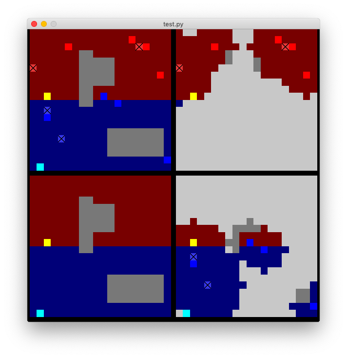

# Capture the Flag Gridworld Environment (gym-cap)

This gridworld environment is specifically designed to simulate the multi-agent adversarial environment.
The environment mimics the capture the flag setup, where the main objective is to capture the enemy's flag as soon as possible.
The game also ends when all the enemy's agents are captured.
The game has many stochastic transitions, such as the interaction between agents, territorial advantage, or random initialization of the map.
A reinforcement learning implementation can be found [here](https://github.com/raide-project/ctf_RL).

## Package Install

The package and required dependencies can be installed using pip:

``` sh
pip install gym-cap
```

## Requirements

All the dependencies will be installed if the package is installed with pip.
If the package is installed using source code, following packages are required:

- Python 3.7+
- Numpy 1.18+
- OpenAI Gym 0.16+

* Gym might require additional packages depending on OS.

## Preparation

Run the example code [(demo run)](demo/test.py) to test if the package is installed correctly.
Basic policies are provided in `gym_cap.heuristic`.

## Environment Description



- The environment takes input as a tuple.
    - The number of element in tuple must match the total number of blue agent. (UAV+UGB)
    - The action must be in range between 0 and 4.
- If UAV is included, the UAV's action comes __in front__ of UGV's action.
    - ex) To make UAV to hover (fix): action = [0, 0] + [UGV's action]

## Custom Policy

To control the __blue agent__, the action can be specified at each step `env.step([0,3,2,4])`.
A custom policy could also be created in module to play the game. 
The example of custom policy can be found in [(custom policy)](demo/demo_policy.py).

## Environment Configurations

### Environment Parameters

The environment is mostly fixed with the default configuration parameters, but some parameters are possible to be modified.
When the environment method `env.reset()` is called, the environment is initialized as same as the previous configuration.
By passing `config_path` argument, prescribed parameters could be modified.

cap_test.py
``` py
observation = env.reset(config_path='custom_config.ini')
```

Here is the example of config file.

custom_config.ini
``` py
# Controllable Variables

[elements]
NUM_BLUE = 4                # number of ground blue agent
NUM_RED = 4                 # number of ground red agent
NUM_BLUE_UAV = 2            # number of air blue agent
NUM_RED_UAV = 2             # number of air red agent


[control]
MAX_STEP = 150              # maximum number of steps in each game

[memory]
                            # [None, fog]
TEAM_MEMORY = None          # if set to fog, team observation includes previously visited static environment
RENDER_TEAM_MEMORY = False  # if set to true, the team memory will be rendered

[settings]
STOCH_TRANSITIONS = False   # switch drift
STOCH_TRANSITIONS_EPS = 0.1 # drift rate
STOCH_ATTACK = True         # switch stochastic interaction between agents
STOCH_ATTACK_BIAS = 1       # territorial advantage in stochastic interaction
STOCH_ZONES = False         # randomize map generation. (if custom_board is give, this parameter is ignored)
BLUE_PARTIAL = True         # switch partial observation for blue
RED_PARTIAL = True          # switch partial observation for red
```

### Custom Map

The environment can be re-initialized to custom board by passing the `.txt` file.
Any board terrain and number of agents will be ignored.

cap_test.py
```py
observation = env.reset(custom_board='test_maps/board2.txt')
```

test_map/board2.txt
```py
0 0 2 4 1 4 1 1 1
2 2 8 8 4 1 1 1 1
0 0 8 8 1 1 1 1 1
6 0 0 1 1 7 0 0 0
0 0 0 1 8 8 0 0 0
0 0 2 4 8 8 0 0 0
1 1 1 0 0 0 1 1 1
1 1 1 0 0 0 1 1 1
1 1 1 0 0 0 1 1 1
```

* board elements are separated by space.

## Advanced Features

### Multi-Agent Communication Settings (work in progress)

```py
agent.get_obs(self, env, com_ground=False, com_air=False, distance=None, freq=1.0, *args)
```

The method returns the observation for a specific agent. If communication is allowed between ground or air, observation for that agent is expanded to include vision from other agents.

Parameters:

- com_ground and com_air (boolean): toggle communication between ground/air units. 
- distance (int): the maximum distance between units for which communication is  
- freq (0-1.0): the probability that communication goes through    

### Policy Evaluation

The demo script `policy_eval.py` provides basic analysis between two policies.

Example)
```bash
$ python policy_eval.py --episode 50 --blue_policy roomba

Episodes Progress Bar

100%|██████████████████████████████████████████████████████████████████████████████████| 50/50 [00:03<00:00, 14.66it/s]
-------------------------------------------- Statistics --------------------------------------
win # overall in 50 episodes: {'BLUE': 31, 'NEITHER': 1, 'RED': 18}
win # in capturing flag    : {'BLUE': 4, 'NEITHER': 15, 'RED': 31}
win # in killing other team: {'BLUE': 14, 'NEITHER': 36}
time per episode: 0.06638088703155517 s
total time: 3.5574886798858643 s
mean steps: 3318.1
```

Valid Arguments:

- episode: number of iterations to analyze (default: 1000)
- blue_policy: policy to be implmented for blue team (default: random)
- red_policy: policy to be implmented for blue team (default: random)
- num_blue: number of blue ugv agents (default: 4)
- num_red: number of red ugv agents (default: 4)
- num_uav: number of uav agents (default: 0)
- map_size: size of map (default: 20)
- time_step: maximum number of steps per iteration to be completed by the teams (default: 150)


### Advanced Agent Types (work in progress)

### Rendering (work in progress)

### Multi-processing (work in progress)

### Gazebo (work in progress)

## Acknowledgement

## License
